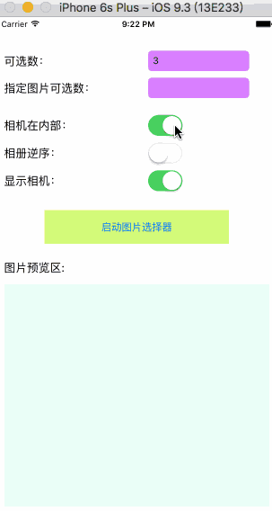
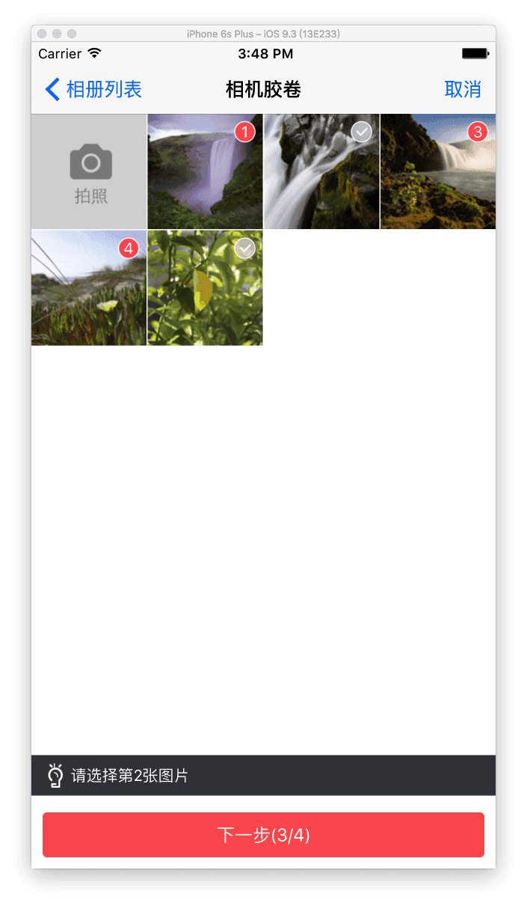
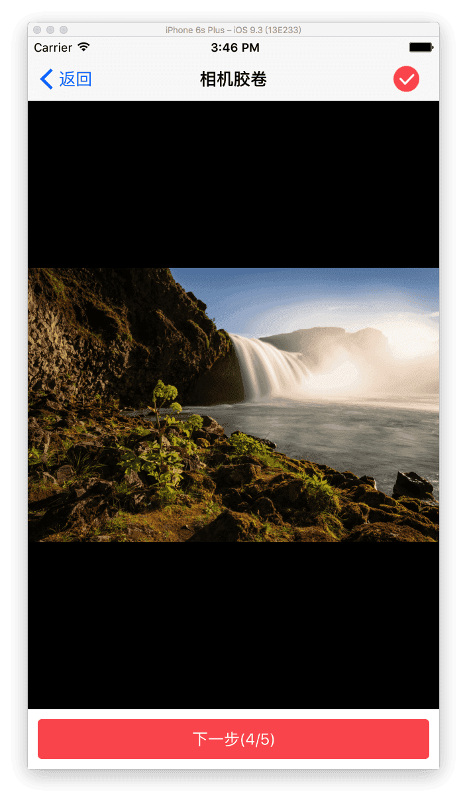
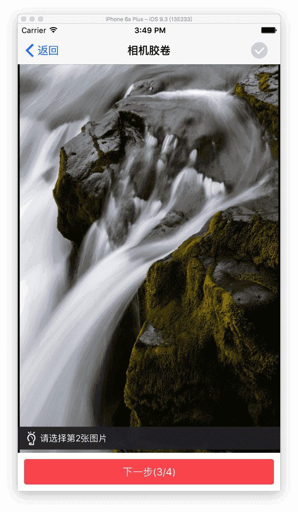
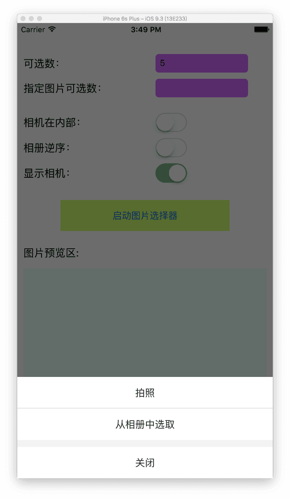
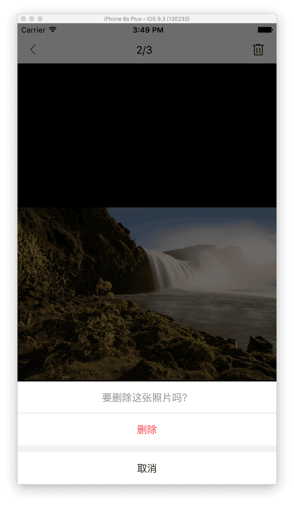

# LBImagePickerController


根据公司项目定制的图片选择器，获取相册部分借鉴了TZImagePickerController，表示感谢!


## 主要包含以下功能

#### - 支持单选或多选模式
#### - 支持可指定要选择的图片标题或者指定要选择的图片的最大数量；
#### - 支持有序选择(指定标题)或无序选择(指定数量)

```
 有序选择表示:
 选择的顺序是固定的，取消某选择项不影响其他已选择的序号；如：已选1、2、3，取消 1，则2、3不变，下一次选择序号为1；
  
 无序选择表示:
 取消某选择项，其他所有的选择项按照之前选的顺序重新排序。如：已选1、2、3，取消 1，则2、3分别变成1、2，下一次选择序号为3
```

#### - 选择器自带预览选择
#### - 对外支持两种预览模式：可删除模式，只读模式

## 效果预览图







## 集成方式
### 1.pod集成

```
pod 'LBImagePickerController'
```

### 2.手动集成

将仓库中的`LBImagePickerController`文件夹拖入项目中


## 主要使用说明

### 1.图片选择器指定要选择的图片标题

``` objective-C
NSArray *titles = @[@"第1张图片",@"第2张图片",@"第3张图片",@"第4张图片"];
LBImagePickerController *picker = [[LBImagePickerController alloc] initWithPhotoTitles:titles cameraInside:YES];
picker.LBImagePickerDidFinishPickingPhotosBlock = ^(NSArray<LBAssetModel *> *assetModels, NSArray<UIImage *> *images) {
 
    };
[self presentViewController:picker animated:YES completion:nil];
```

### 2.图片选择器只指定要选择的图片数量

``` objective-C
LBImagePickerController *picker = [[LBImagePickerController alloc] initWithMaxImagesCount:5 cameraInside:YES];
picker.LBImagePickerDidFinishPickingPhotosBlock = ^(NSArray<LBAssetModel *> *assetModels, NSArray<UIImage *> *images) {
 
    };
[self presentViewController:picker animated:YES completion:nil];
```

### 3.对外预览模式

``` objective-C
LBPhotoPreviewController *previewVc = [[LBPhotoPreviewController alloc] initWithImages:images];
previewVc.autoPositionIndex = 0;
previewVc.didDeletedBlock = ^(NSInteger index,UIImage *image) {     
    };
[self presentViewController:previewVc animated:YES completion:nil];
```

## 备注
iOS10 访问相册和相机需要额外配置info.plist文件：
分别是Privacy - Photo Library Usage Description和Privacy - Camera Usage Description字段


